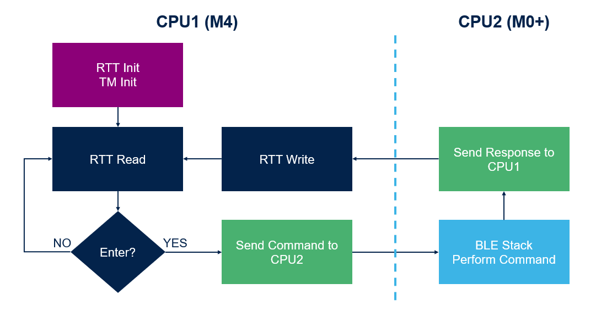
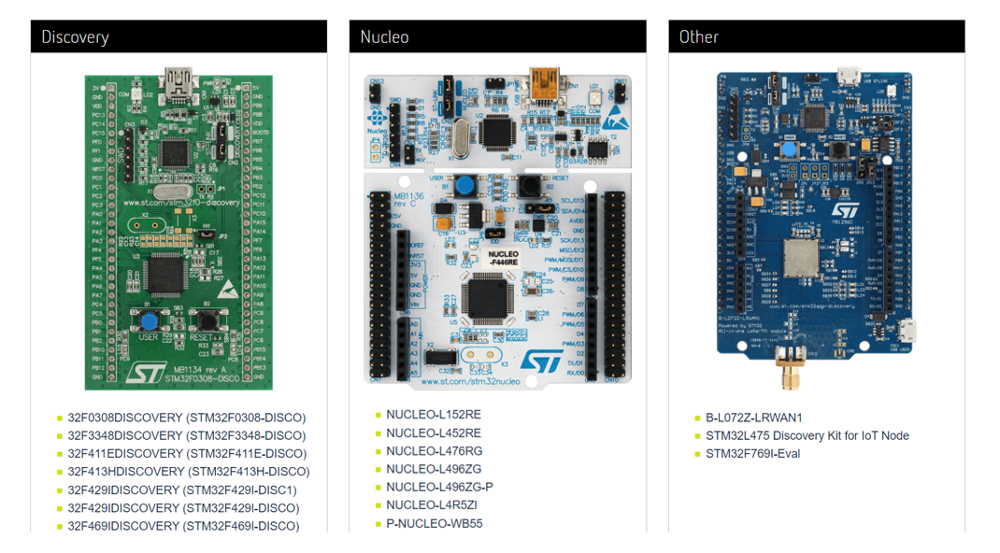
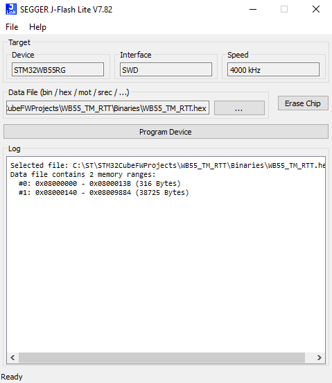
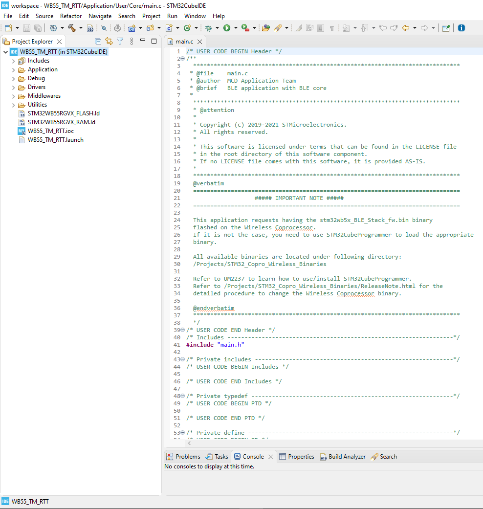
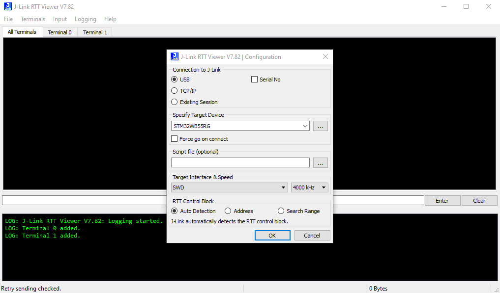
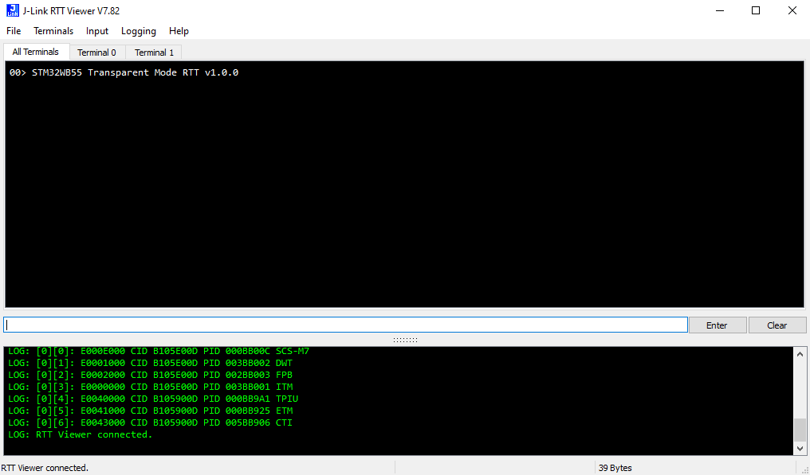
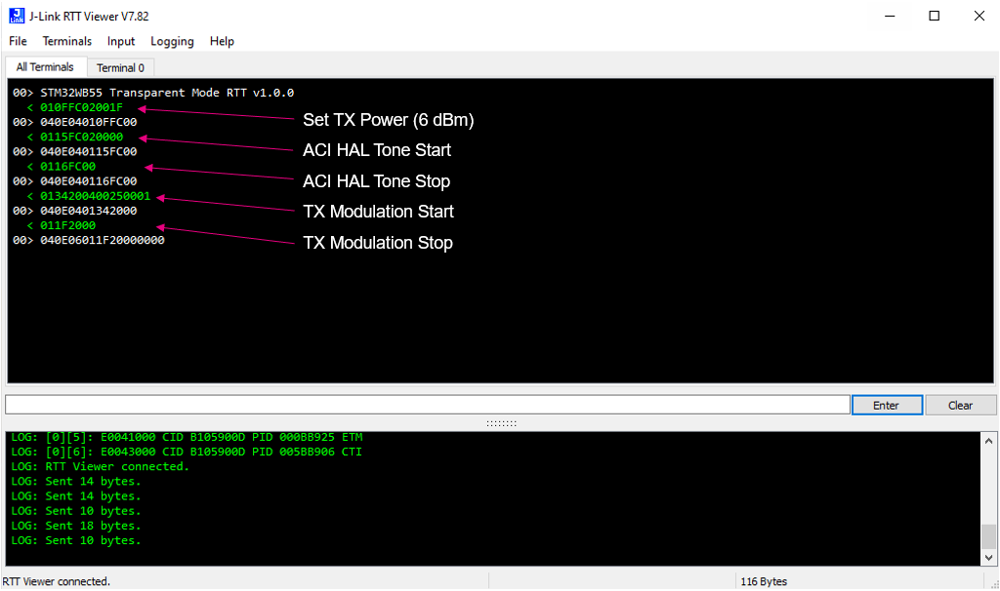

# STM32WB55-BLE-TransparentMode-RTT

* The STM32WB55-BLE-TM-RTT is an application example based on the BLE_TransparentMode application found in the [STM32CubeWB](https://www.st.com/en/embedded-software/stm32cubewb.html) firmware package.
* This example replaces the original TransparentMode's UART functionality with [SEGGER's RTT](https://wiki.segger.com/RTT).
* This allows you to send ACI/HCI commands using [SEGGER's tools](https://www.segger.com/downloads/jlink/) or a command line interface.
    * The original TransparentMode would use [STM32CubeMonitor-RF](https://www.st.com/en/development-tools/stm32cubemonrf.html) instead.
    * A list of supported ACI/HCI commands can be found in [AN5270](https://www.st.com/resource/en/application_note/an5270-stm32wb-bluetooth-low-energy-wireless-interface-stmicroelectronics.pdf) and in [STM32CubeMonitor-RF](https://www.st.com/en/development-tools/stm32cubemonrf.html).

## TM Modifications Made for Adding RTT Support

* Added [RTT Files](https://github.com/SEGGERMicro/RTT) to Project
* Removed the LSE, LPUART1, USART1, Button, & LED Peripherals
* app_conf.h
    * Disabled Low Power Mode (CFG_LPM_SUPPORTED)
    * Enabled Debugger (CFG_DEBUGGER_SUPPORTED)
    * Added RTT Read Sequencer Task (CFG_TASK_RTT_READ_POLL_ID)
* tm.c
    * Included SEGGER_RTT.h Header File
    * Edited TM_Init() to Configure Up Buffer & Start RTT Read Task
    * Added RTT Read Function (TM_RTT_Read_Poll_Task())
    * Added RTT Send Command Function (TM_RTT_Send_Command())
    * Edited TM_TXToHost() to Replace UART with RTT

## TransparentMode RTT Flowchart

## Hardware Needed

  * One [P-NUCLEO-WB55](https://www.st.com/en/evaluation-tools/p-nucleo-wb55.html)

  * One SEGGER [J-Link / J-Trace Debug Probe](https://www.segger.com/products/debug-trace-probes/) (Optional)
    * The Hardware Debug Probe is optional if you use the [ST-Link Reflash Utility](https://www.segger.com/products/debug-probes/j-link/models/other-j-links/st-link-on-board/) instead.

## Software Needed

  * Prebuilt firmware image: WB55_TM_RTT.hex (STM32WB55-BLE-TransparentMode-RTT\Binaries)

  * [J-Link Software Pack](https://www.segger.com/downloads/jlink/)

  * [ST-Link Reflash Utility](https://www.segger.com/products/debug-probes/j-link/models/other-j-links/st-link-on-board/) (Optional)
    * This tool is optional if you use the Hardware Debug Probe instead.

## User's Guide

1) Flash the NUCLEO-WB55 with the BLE Full or BLE Full Extended Stack based on the features you need. 

    a) Check [UM2288](https://www.st.com/resource/en/user_manual/um2288-stm32cubemonitorrf-software-tool-for-wireless-performance-measurements-stmicroelectronics.pdf) section 3.2 to see the features available in each stack. 

    b) Follow this [video](https://youtu.be/1LvfBC_P6eg) for instructions on flashing the Wireless Stack.

2) Setup the J-Link with the NUCLEO-WB55 using one of the 2 options below:

    a) Connect a Hardware J-Link debug probe to the Nucleo board. Follow this [article](https://community.st.com/s/article/how-to-connect-a-j-link-debug-probe-to-the-nucleo-wb55rg) for instructions on how to connect it.

    b) Use the ST-Link Reflash Utility to convert the on-board ST Link to a J-Link.

    > Note: Not all STM32 devices are compatible with this tool, please check compatibility [here](https://www.segger.com/products/debug-probes/j-link/models/other-j-links/st-link-on-board/#:~:text=LINK%20on%2Dboard%3A-,Compatible%20Evaluation%20Boards,-The%20following%20evaluation). 

    

3) Flash the application firmware on to the nucleo board using one of the 2 options below:

    a) Use [J-Flash LITE](https://www.segger.com/products/debug-probes/j-link/technology/flash-download/#:~:text=statistics%20upon%20success.-,J%2DFlash%20LITE,-J%2DFlash%20Lite) included with the [J-Link Software Pack](https://www.segger.com/downloads/jlink/) to download the hex file on to the Nucleo board.

    

    b) Open your preferred IDE (Keil MDK-ARM, IAR EWARM, or STM32CubeIDE) and build & run the project to download it on to the Nucleo board.

    

4) Open RTT Viewer from the [J-Link Software Pack](https://www.segger.com/downloads/jlink/) and connect to the Nucleo board.

5) Once the application example has started, you will see an initial message.

    > Note: You may need to press the SW4 reset button to start the application example.

6) Use the input box to send ACI/HCI commands from the HOST PC to the embedded device.

    a) A list of supported ACI/HCI commands can be found in [AN5270](https://www.st.com/resource/en/application_note/an5270-stm32wb-bluetooth-low-energy-wireless-interface-stmicroelectronics.pdf) and in [STM32CubeMonitor-RF](https://www.st.com/en/development-tools/stm32cubemonrf.html).

    b) Use the Input tab to toggle sending on input or on enter and to change the EOL character. 

## Troubleshooting

**Caution** : Issues and the pull-requests are **not supported** to submit problems or suggestions related to the software delivered in this repository. The STM32WB55-BLE-TransparentMode-RTT example is being delivered as-is, and not necessarily supported by ST.

**For any other question** related to the product, the hardware performance or characteristics, the tools, the environment, you can submit it to the **ST Community** on the STM32 MCUs related [page](https://community.st.com/s/topic/0TO0X000000BSqSWAW/stm32-mcus).